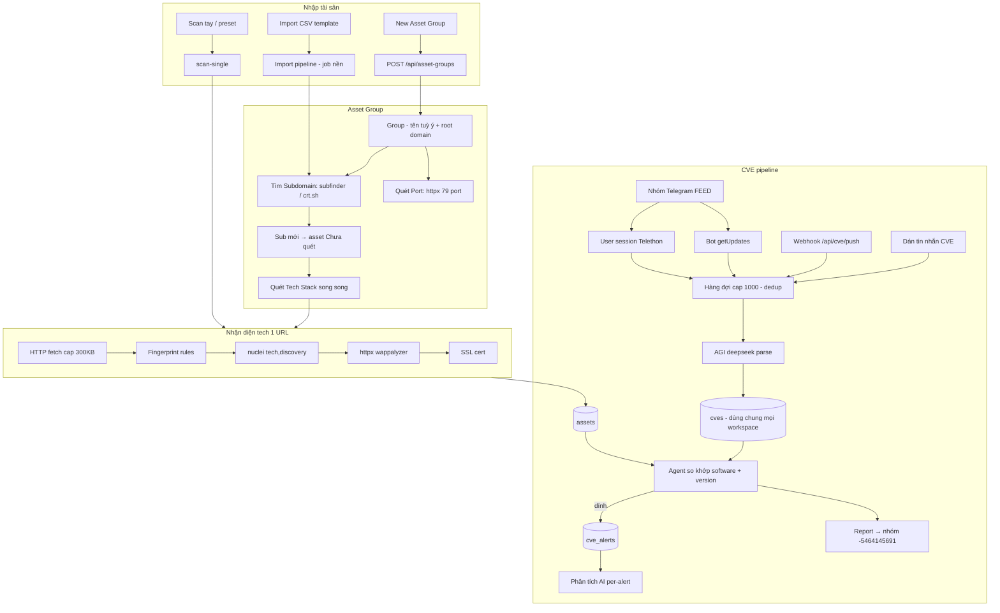

# TechAsset Discovery — Sơ đồ hệ thống

## 1. Sơ đồ kiến trúc tổng thể

```
┌──────────────────────────────────── VPS 103.107.181.95 ────────────────────────────────────┐
│                      Docker container (host network, HTTPS :8787)                          │
│                                                                                            │
│  ┌──────────────┐   static/dist   ┌──────────────────────────────────────────────────┐    │
│  │  React SPA   │◄───────────────►│              FastAPI Backend                     │    │
│  │  (Vite + TW) │   REST API      │  ┌──────────┐ ┌───────────┐ ┌────────────────┐   │    │
│  └──────────────┘                 │  │ Auth     │ │ Workspaces│ │ Asset Groups   │   │    │
│        ▲                           │  │ session +│ │ CRUD      │ │ CRUD + rename  │   │    │
│        │                           │  │ X-API-Key│ └───────────┘ └────────────────┘   │    │
│  Browser/Pentester                 │  └──────────┘ ┌───────────┐ ┌────────────────┐   │    │
│                                    │               │ Inventory │ │ CVE Kho + KBC  │   │    │
│                                    │               │ + facets  │ │ (dùng chung)   │   │    │
│                                    │               └───────────┘ └────────────────┘   │    │
│                                    └───────────────┬──────────────────────────────────┘    │
│                                                    │                                       │
│  ┌───────────────────────── Engine layer (subprocess/async) ─────────────────────────┐    │
│  │ scanner.py            fingerprint rules + fetch (cap 300KB) + SSL                  │    │
│  │ nuclei                -tags tech,discovery  (CMS/framework)                        │    │
│  │ httpx                 79 web ports + wappalyzer tech-detect                        │    │
│  │ subfinder / crt.sh    passive subdomain discovery                                  │    │
│  └────────────────────────────────────────────────────────────────────────────────────┘    │
│                                                    │                                       │
│  ┌───────────────────────── Telegram / AGI layer ────────────────────────────────────┐    │
│  │ telegram_listener   Bot API getUpdates → queue (cap 1000, 2 workers, dedup)       │    │
│  │ telegram_user       Telethon user session (READ-ONLY) — thấy mọi tin + backfill   │    │
│  │ telegram            Bot token gửi report → nhóm -5464145691                       │    │
│  │ ai.py               AGI deepseek (litellm proxy) — parse CVE + phân tích          │    │
│  │ cve_engine          agent so khớp CVE ↔ asset (software + version range)          │    │
│  └────────────────────────────────────────────────────────────────────────────────────┘    │
│                                                    │                                       │
│                                     SQLite WAL (backend/data/techasset.db)                 │
│                     workspaces │ asset_groups │ assets │ cves │ cve_alerts │ cron_jobs     │
└────────────────────────────────────────────────────────────────────────────────────────────┘
              ▲                                        ▲
              │ login (user+pass+TOTP)                 │ X-API-Key (webhook bot ngoài)
        Người dùng                              Bot CVE feed
```

## 2. Luồng dữ liệu chính (Mermaid)



## 3. Sơ đồ thành phần dữ liệu

```
workspaces (id, name, is_default)
   1───n asset_groups (root_domain, subdomains_json, meta_json, workspace_id)
   1───n assets        (url UNIQUE, host, web_server, technologies_json,
                        asset_group_id, workspace_id, meta_json)
n───1 asset_groups

cves (cve_id UNIQUE, software, affected_versions, severity) ── dùng chung mọi workspace
   1───n cve_alerts (cve_id + matched_asset_id UNIQUE, status: active/investigating/resolved)
```

## 4. Ranh giới bảo mật

- **Web UI**: session cookie (user + password + TOTP 2FA), HTTPS self-signed
- **Bot/webhook ngoài**: header `X-API-Key` = `CVE_PUSH_API_KEY`
- **Telegram user session**: chỉ ĐỌC feed group — không có đường gửi tin bằng tài khoản user
- **Admin Settings**: chỉ key allowlist được ghi vào `.env`; value rỗng bị chặn (chống wipe secret)
